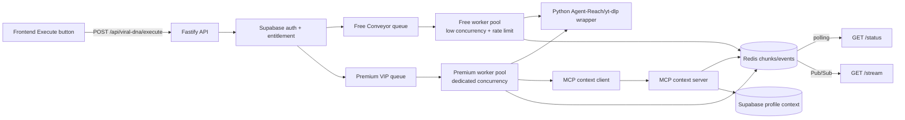

# Backend Engine Implementation Architecture

## Scope of this repository

This repository is the dedicated heavy-processing microservice for TubeClick Pro. It owns authenticated job admission, tier enforcement, BullMQ queues, Python extraction workers, MCP context tools, delivery, and durable run metadata. It contains no frontend code.

## Runtime topology

## Queue namespace

The documented namespace is `viral-dna:extract`. BullMQ prohibits `:` inside a queue name, so the implementation uses the namespace as the BullMQ key prefix and two concrete queues:

- `viral-dna-extract-free`
- `viral-dna-extract-premium`

This is deliberate isolation, not merely a priority number in one shared backlog. Premium work cannot be trapped behind a large Free backlog, and Free workers cannot consume Premium jobs.

## Processes

### API process

- Authenticates Supabase JWTs.
- Looks up the active subscription server-side.
- Ignores any client-supplied tier.
- Applies per-user tier limits in Redis.
- Enqueues a job and returns HTTP 202 immediately.
- Serves owner-scoped polling and Premium SSE.

### Free worker

- Reads only the Free queue.
- Runs with lower concurrency and a strict global queue limiter.
- Requests `basic` extraction.
- Produces no deep hook analysis or Micro-Critic output.
- Delivers through polling.

### Premium worker

- Reads only the Premium queue.
- Has dedicated concurrency and its own rate policy.
- Requests `deep` extraction with 0–10 second transcript chunks.
- Stores extracted context in Redis.
- Invokes the Micro-Critic through the local MCP context server.
- Publishes progress over Redis Pub/Sub for SSE.

### Python capability worker

Agent-Reach is a capability and backend-selection layer rather than a server API. Its current YouTube path uses `yt-dlp`; the isolated Python worker invokes that backend directly with an argument array and `shell=false` semantics.

The initial slice:

- accepts only HTTPS YouTube URLs;
- downloads no video or audio media;
- reads metadata and available caption tracks;
- caps output and caption response sizes;
- enforces subprocess timeouts;
- detects upstream challenges and does not bypass them.

## Primary/fallback resilience

Every tier pipeline receives a `ResilientYouTubeExtractor`, not a provider-specific client. It always tries Agent-Reach first. Any primary execution failure—including timeout, rate rejection, CAPTCHA/challenge response, malformed output, or process failure—activates the official YouTube Data API client automatically.

The fallback calls `videos.list` for video metadata and `channels.list` for channel metadata. Channel lookup is partial-failure tolerant: a successful video response remains usable if the second channel call fails. Because the official API does not expose captions, fallback results explicitly contain empty transcript/hook arrays and a warning rather than fabricated transcript content.

Authorized keys are read as a trimmed comma-separated pool from `YOUTUBE_API_KEY`; they are never logged or returned. On quota/rate 403 or 429, the client advances to the next slot and retries the same request. The last successful slot remains preferred for subsequent calls. Production workers refuse to start with an empty pool, preventing deployment with a silently disabled reliability layer.

## Persistence

Redis is the hot store for job state, progress, MCP context, rate limits, and Pub/Sub. Supabase is the durable run ledger and owns subscription entitlements. `supabase/migrations/202608160001_viral_dna_foundation.sql` creates the initial tables and RLS.

## Delivery

### Free

`GET /api/viral-dna/status?jobId=<uuid>` returns an owner-scoped snapshot. Frontend polling should start at 3 seconds and back off under load.

### Premium

`GET /api/viral-dna/stream?jobId=<uuid>` returns an authenticated SSE stream. Redis Pub/Sub carries events; 15-second comments keep intermediaries from closing the connection. Free users receive `PREMIUM_STREAM_REQUIRED`.

## Horizontal scaling

- API instances are stateless.
- Worker deployments scale independently by tier.
- Rate-limit and active-job state is centralized in Redis.
- Jobs are retryable and idempotently identified by UUID.
- Supabase and Redis remain the system of record; no local job JSON is used.

The foundation is suitable for horizontal scaling, but “10,000 concurrent requests” requires measured load testing, Redis sizing, provider limits, worker autoscaling, and a compliant extraction capacity plan. It is not guaranteed by a worker-count constant.
